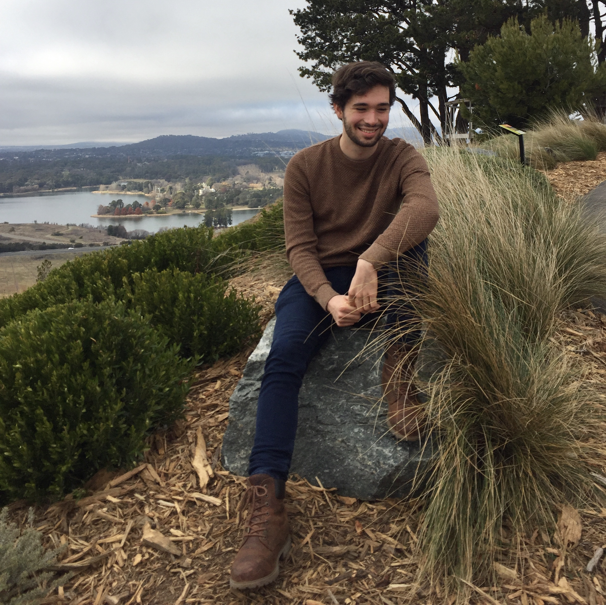

{: .profile }

Welcome to my website.

This is a list of stuff I currently do:

- think about how we can teach people to code better
- tutor [COMP1720](https://cs.anu.edu.au/courses/comp1720) (semester 2, 2019 and 2020), and [COMP2300](https://cs.anu.edu.au/courses/comp1720) (semester 1 2020)
- hack on [CECS's](https://cecs.anu.edu.au) teaching infrastructure with [Ben](https://benswift.me)
- run around the dark with a map and compass (when i'm not injured)
- ride a bike with only one gear
- procrastinate at uni

You can see most of the things I've done in the past on my [GitHub](https://github.com/paked).
